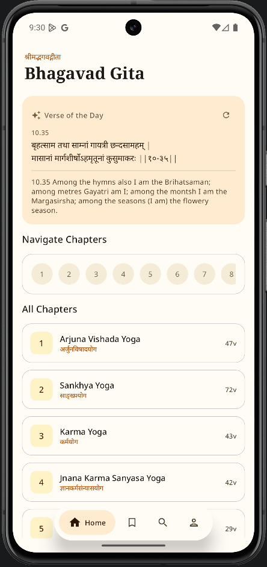
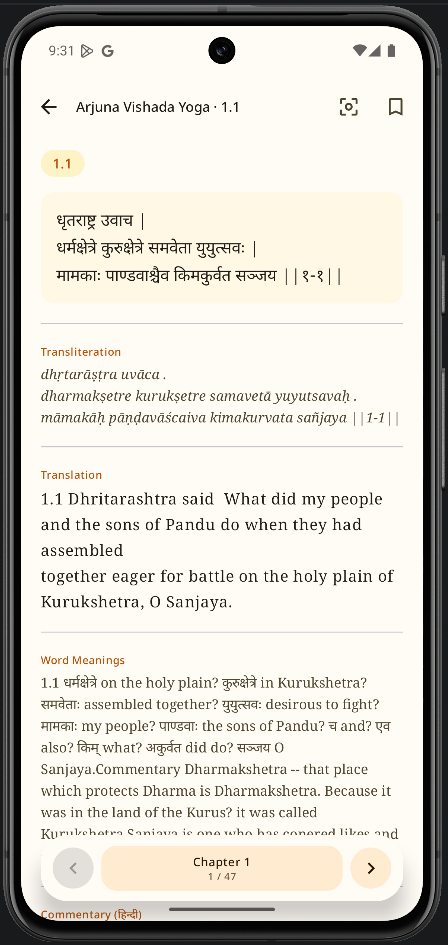
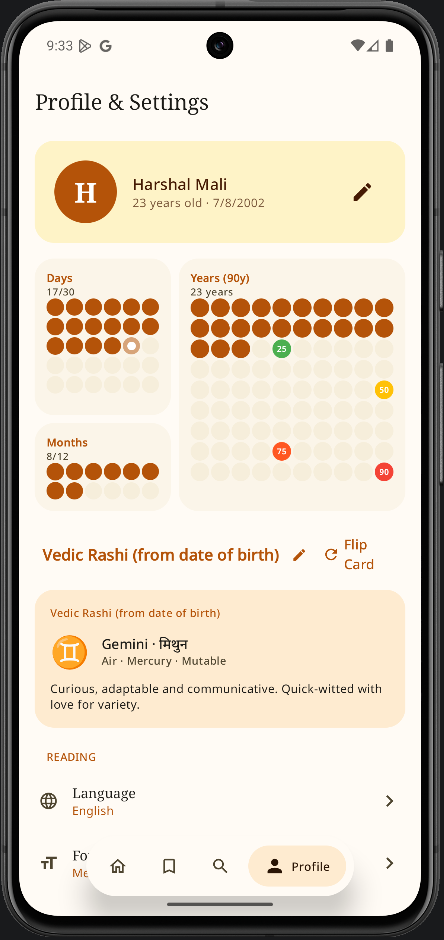
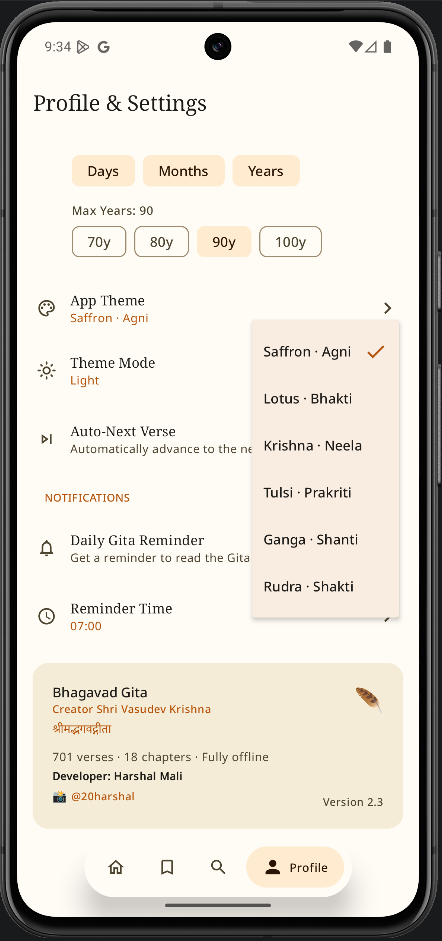
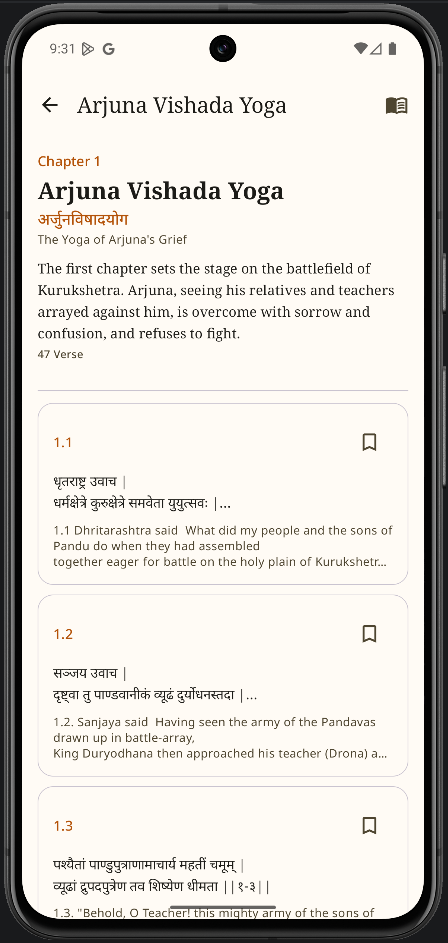
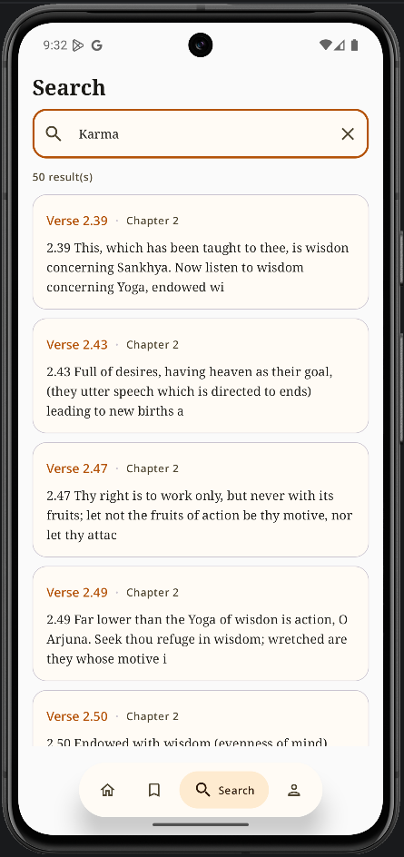
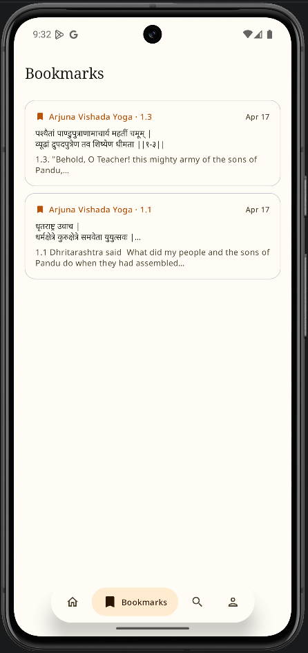
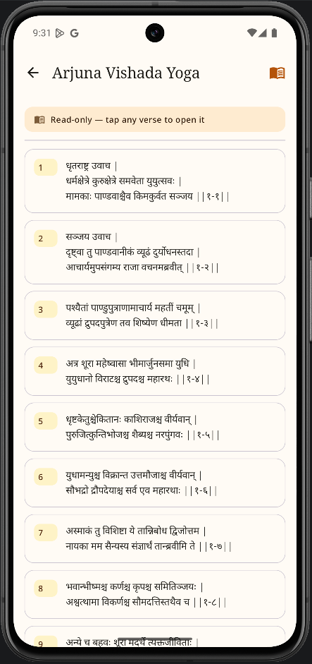

# 🕉 GitaApp

A modern, soulful, and feature-rich Bhagavad Gita application built with **Jetpack Compose**. Experience the divine wisdom of the Gita with a personalized touch, featuring Vedic insights and a unique life-progress visualization.

---

## ✨ Features

### 📖 Immersive Reading Experience
- **Bilingual Support**: Toggle seamlessly between **Hindi** and **English**.
- **Deep Insights**: Access Word Meanings, Transliteration, and detailed Commentaries for every verse.
- **Customizable UI**: Adjust font sizes and switch between Light, Dark, and System themes.
- **Focus Mode**: Minimize distractions for a meditative reading experience.
- **Auto-Next**: Hands-free reading with adjustable transition intervals.

### 🧘 Personalized Vedic Profile
- **Life Indicator**: A unique visualization of your life's journey (Days, Months, and Years) with milestone markers (25, 50, 75, 100 years).
- **Vedic & Nam Rashi**: Automatically calculate your Rashi based on birth details or set it manually.
- **Daily Reminders**: Stay consistent with customizable daily notification reminders.

### 📱 Modern Android Integration
- **Material 3**: Built with the latest Material Design components for a beautiful, responsive look.
- **Home Screen Widgets**: Get daily verses directly on your home screen using **Jetpack Glance**.
- **Offline First**: All data is stored locally for instant access anytime, anywhere.

---

## 🛠 Tech Stack

- **UI**: [Jetpack Compose](https://developer.android.com/jetpack/compose) (100%)
- **Architecture**: MVVM with Clean Architecture principles.
- **Dependency Injection**: [Hilt](https://developer.android.com/training/dependency-injection/hilt-android)
- **Database**: [Room](https://developer.android.com/training/data-storage/room)
- **Preferences**: [DataStore](https://developer.android.com/topic/libraries/architecture/datastore)
- **Asynchronous Flow**: Kotlin Coroutines & Flow
- **Widgets**: [Jetpack Glance](https://developer.android.com/jetpack/last-guide/glance)
- **Navigation**: Compose Navigation

---

## 📸 Screenshots

| Home Screen | Reading View | Profile & Life | Theme Options |
| :---: | :---: | :---: | :---: |
|  |  |  |  |

| Chapters List | Search Function | Bookmarks | Chapter Detail |
| :---: | :---: | :---: | :---: |
|  |  |  |  |

---

## 🚀 Getting Started

1. **Clone the repository**:
   ```bash
   git clone https://github.com/yourusername/GitaApp.git
   ```
2. **Open in Android Studio**:
   Ensure you have the latest version of Android Studio (Koala or newer recommended).
3. **Build & Run**:
   Sync Gradle and run the `:app` module on your device or emulator.

---

## 🤝 Contributing

Contributions are welcome! If you find any bugs or have feature suggestions, please open an issue or submit a pull request.

---

## 📜 License

This project is licensed under the MIT License - see the [LICENSE](LICENSE) file for details.

---

## 🙏 Acknowledgments

- Inspired by the timeless wisdom of the **Bhagavad Gita**.
- Icons by Google Material Icons.
- Built with ❤️ for seekers of truth.